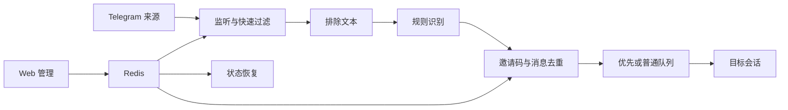

<div align="center">

# SlowLink

**面向低配置服务器的 Telegram 消息监听、识别、去重与转发系统**

[](https://github.com/szjhsa/SlowLink/releases/latest)
[](https://github.com/szjhsa/SlowLink/actions/workflows/release.yml)
[](https://www.python.org/)
[](https://www.docker.com/)
[](LICENSE)

[快速安装](#快速安装) · [日常管理](#日常管理) · [更新日志](docs/CHANGELOG.md) · [版本发布](https://github.com/szjhsa/SlowLink/releases) · [运维说明](docs/OPERATIONS.md)

</div>

SlowLink 基于 Telethon、Flask 和 Redis，监听指定 Telegram 群组或频道，按配置规则识别目标内容，完成去重后转发到指定会话。项目针对单核、低内存服务器持续运行场景做了队列、连接恢复和 CPU 保护。

## 快速安装

支持 Ubuntu、Debian，需要 `root` 或 `sudo` 权限。脚本会自动安装 Docker Engine 与 Docker Compose，并显示中文管理菜单。

```bash
curl -fsSL https://raw.githubusercontent.com/szjhsa/SlowLink/main/deploy/install.sh | sudo bash
```

默认安装目录为 `/opt/slowlink`。菜单会先选择网页访问方式：

- `域名 HTTPS（推荐）`：输入已解析到服务器的域名，脚本自动启动 Caddy 并申请证书。
- `IP + 自定义端口 HTTP`：保持原有访问方式，默认端口 `8080`。

非交互安装可以直接指定 HTTPS 域名：

```bash
curl -fsSL https://raw.githubusercontent.com/szjhsa/SlowLink/main/deploy/install.sh -o /tmp/slowlink-install.sh
sudo sh /tmp/slowlink-install.sh --domain slowlink.example.com
```

也可以明确使用 HTTP 和自定义端口：

```bash
curl -fsSL https://raw.githubusercontent.com/szjhsa/SlowLink/main/deploy/install.sh -o /tmp/slowlink-install.sh
sudo sh /tmp/slowlink-install.sh --http --port 18080
```

安装器会预检端口占用且不会停止现有服务。访问模式、绑定地址、端口和域名保存在 `/opt/slowlink/.env`，后续更新会完整沿用。

在网页中登录 Telegram、配置监听来源、转发目标和识别规则即可开始监听。

## 主要功能

| 功能 | 说明 |
| --- | --- |
| Telegram 监听 | 监听配置的群组和频道，支持动态刷新监听列表 |
| 内容识别 | 用户正则原样匹配 Telegram 原始消息，邀请码规则负责结构化提取 |
| 文本排除 | 消息包含任意排除关键词时，在正则和码识别前直接忽略 |
| 准确去重 | 按实际邀请码与消息特征去重，保留必要的重复日志 |
| 优先队列 | 对重点来源优先处理，降低高消息量时的排队延迟 |
| Web 管理 | 管理登录、监听、规则、状态与运行日志，支持域名 HTTPS |
| 自动恢复 | 容器或主机重启后，根据 Redis 状态恢复监听 |
| CPU 保护 | 持续高 CPU 时记录诊断并只重启应用容器 |
| 安全更新 | 下载 GitHub Release、校验 SHA-256 后再更新 |

## 工作流程



## 日常管理

安装后使用统一管理脚本：

| 命令 | 用途 |
| --- | --- |
| `sudo /opt/slowlink/deploy/manage.sh status` | 查看版本、容器、监听、Redis、Session 与 watchdog 状态 |
| `sudo /opt/slowlink/deploy/manage.sh logs` | 查看应用实时日志 |
| `sudo /opt/slowlink/deploy/manage.sh restart` | 只重启 `slowlink_app` |
| `sudo /opt/slowlink/deploy/manage.sh update` | 更新到最新正式版本 |
| `sudo /opt/slowlink/deploy/manage.sh web` | 切换域名 HTTPS 或 IP + 端口 HTTP |
| `sudo /opt/slowlink/deploy/manage.sh backup` | 备份配置、Session 和 Redis 数据 |
| `sudo /opt/slowlink/deploy/manage.sh uninstall` | 卸载程序并保留数据 |
| `sudo /opt/slowlink/deploy/manage.sh purge` | 二次确认后彻底删除 SlowLink |

## 数据与稳定性

- 更新只重建 `slowlink_app`；正常运行且域名未变的 `slowlink_caddy` 会保持不动，也不会停止 `slowlink_redis` 或主机上的其他服务。
- `.env`、`data`、Telegram Session、Redis 数据和用户配置会被保留。
- HTTPS 模式下应用端口只绑定 `127.0.0.1`，公网入口由 Caddy 的 80/443 提供。
- Docker 健康检查负责检测 Web 服务状态。
- CPU watchdog 仅在应用容器持续高负载时执行保护，并保存诊断日志。
- 监听期望状态存入 Redis，应用重启后可自动恢复。
- Docker 日志限制大小与保留数量，避免长期运行占满磁盘。

## 版本发布

推送 `v*` 标签后，GitHub Actions 会自动运行编译检查、单元测试和 Shell 语法检查，并发布三个资产：

| 资产 | 用途 |
| --- | --- |
| `slowlink_app_v*.zip` | 仅应用代码更新包 |
| `slowlink_v*_full.zip` | 完整安装包 |
| `SHA256SUMS.txt` | 发布文件完整性校验 |

更新内容会直接写入 GitHub Release 正文；`slowlink_v*_update_log.txt` 仅保留在本地归档中，不上传到 Release。最新版本请前往 [GitHub Releases](https://github.com/szjhsa/SlowLink/releases/latest) 下载。

## 项目结构

```text
slowlink/
├── app/                    # SlowLink 应用与 Web 界面
├── docs/                   # 运维文档
├── scripts/                # 发布构建与安装公共逻辑
├── tests/                  # 回归测试
├── deploy/                 # Docker、一键安装与管理脚本
└── docs/                   # 文档与更新日志
```

## 安全说明

仓库和 Release 不包含 `.env`、密码、Token、Telegram Session、数据库、Redis 数据、日志或备份。部署时不要将这些运行时文件提交到 Git。

## 许可证

本项目采用 [MIT License](LICENSE)。
